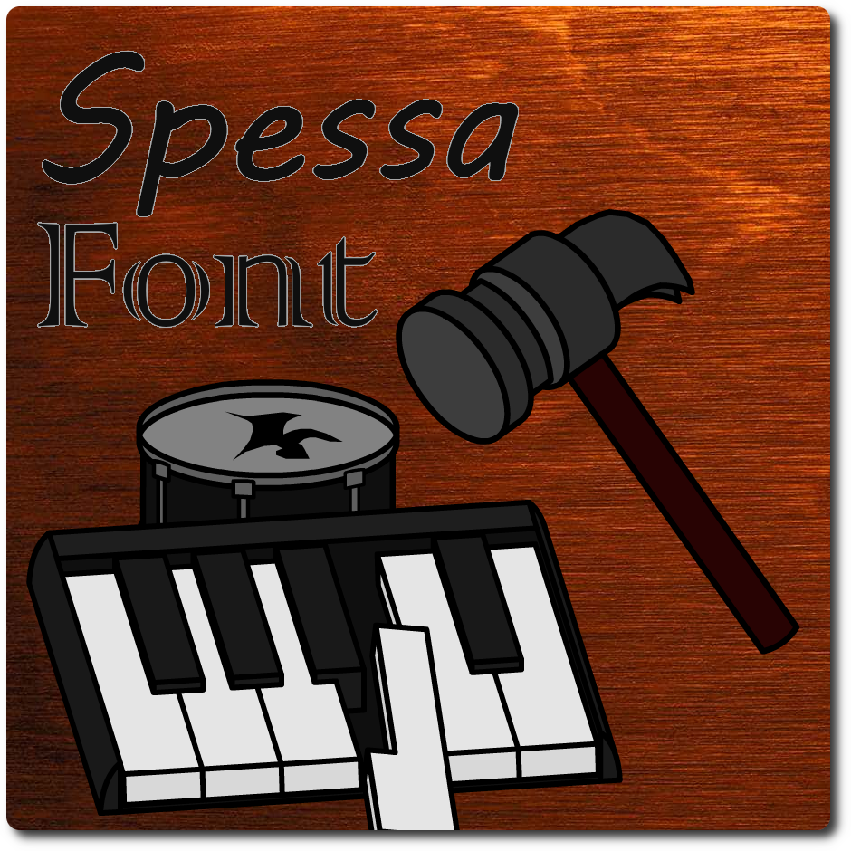

<!--suppress HtmlDeprecatedAttribute, CheckImageSize -->

Fully online SoundFont/DLS Editor, written in TypeScript and React.
No download needed!

**v1.0.0 is here!**

## [Try it out!](https://spessasus.github.io/SpessaFont)

**SpessaSynth Project index**

- [spessasynth_core](https://github.com/spessasus/spessasynth_core) - SF2/DLS/MIDI library
- [spessasynth_lib](https://github.com/spessasus/spessasynth_lib) - spessasynth_core wrapper optimized for browsers and WebAudioAPI
- [SpessaSynth](https://github.com/spessasus/SpessaSynth) - online/local MIDI player/editor application
- [SpessaFont](https://github.com/spessasus/SpessaFont) (you are here) - online SF2/DLS editor

## Description

This is an online SoundFont/DLS editor based on [spessasynth_core](https://github.com/spessasus/spessasynth_core),
inspired by
Davy7125's [polyphone](https://github.com/davy7125/polyphone).
This is also my first TypeScript and React project. It's a bit messy, but it works! :-P

## Features

- **Fully online:** _No download needed!_
- **Multiple tabs:** _Copy between sound banks or edit multiple of them at once!_
- **Multiple formats import and export:**
    - **SF2** - _SoundFonts!_
    - **SF3** - _Compressed SoundFonts with compression preservation!_
    - **SFOGG** - _SF2Pack! (import only)_
    - **DLS** - _DownLoadable Sounds with articulator support!_
    - **Mobile DLS** - _Apparently it's different from DLS... So I'm including it as well!_
- **Built-in MIDI player:** _Test your bank with a MIDI file!_
- **Real-time synthesizer:**
    - _Fully-featured spessasynth_core's synthesizer!_
    - _Instant response to parameter changes! (to new notes)_
    - _Full modulator support!_
    - _Full generator support!_
    - _GM, GM2, GS, XG support!_
    - _Built-in effects!_
    - _Somewhat configurable!_
- **SoundFont Extensions:**
    - **Default modulator editing:** _Via the DMOD chunk!_
    - **Limitless SoundFonts:** _Via the xdta chunk!_
- **Undo and redo system:** _It was a pain to code..._
- **Supports both light and dark modes!**
- **Useful tools:**
    - **Clipboard system:** _Automatically inserts all needed elements!_
    - **Remove unused elements:** Trim the soundbank's size!
    - **Auto-link samples:** _Automatically repair broken stereo samples based on names! (Looking at you, FluidR3_GM)_
- **Built-in MIDI Keyboard:**
    - _Clickable!_
    - _Shows the key number and velocity!_
    - _Shows keys that don't have a match for a given preset or instrument!_
    - _Controller knobs and pedals are customizable!_
    - _Supports external MIDI devices!_
    - _Looks cool!_
    - _Responds to the MIDI player!_
- **Extensive sample editing:**
    - **Automatic stereo samples handling:** _Including import and name editing!_
    - **Replace samples in-place:** _Broken sample referenced everywhere? No problem!_
    - **Easy loop point setting:** _Just click!_
    - **Insane zoom values:** _Why not?_
- **Instrument and preset editing:**
    - **Grouped stereo samples:** _Avoid clutter when making stereo banks!_
    - **Default values are shown:** _So you don't need to look them up!_
    - **Normal units:** _Only in the instrument editor..._
    - **Automatic stereo sample adding:** _Forgot to select the right sample? No problem!_
    - **Duplicate preset numbers safeguard:** _Of course!_

## Some screenshots!

</img>
</img>
</img>
</img>
</img>
</img>

[If you would like to help translate SpessaFont, please read this guide (and thank you!)](src/locale/README.md)

## Download Locally

SpessaFont is a PWA app, meaning you can install it on any device with just one click:

## Building from source

### Development

1. Make sure you have Node.js installed
2. Clone this repository
3. `npm install`
4. `npm run dev`
5. Open the link that appears in the terminal

**Note:** There are some performance issues when searching for elements.
This does not affect the production build though.

### Build for production

1. Make sure you have Node.js installed
2. Clone this repository
3. Clone
4. `npm install`
5. `npm run build`
6. The `dist` directory contains the built HTML and other files

## Credits

- [sl-web-ogg](https://github.com/erikh2000/sl-web-ogg) - for the Ogg Vorbis encoder
- [Bootstrap Icons](https://icons.getbootstrap.com/) - for the icons

_Editing sound banks has never been easier!_

_beautiful animation by my friend, AlfaFranekPolak_

### License

Copyright © 2026 Spessasus.
Licensed under the Apache-2.0 License.

#### Legal

This project is in no way endorsed or otherwise affiliated with the MIDI Manufacturers Association,
Creative Technology Ltd. or E-mu Systems, Inc., or any other organization mentioned.
SoundFont® is a registered trademark of Creative Technology Ltd.
All other trademarks are the property of their respective owners.
